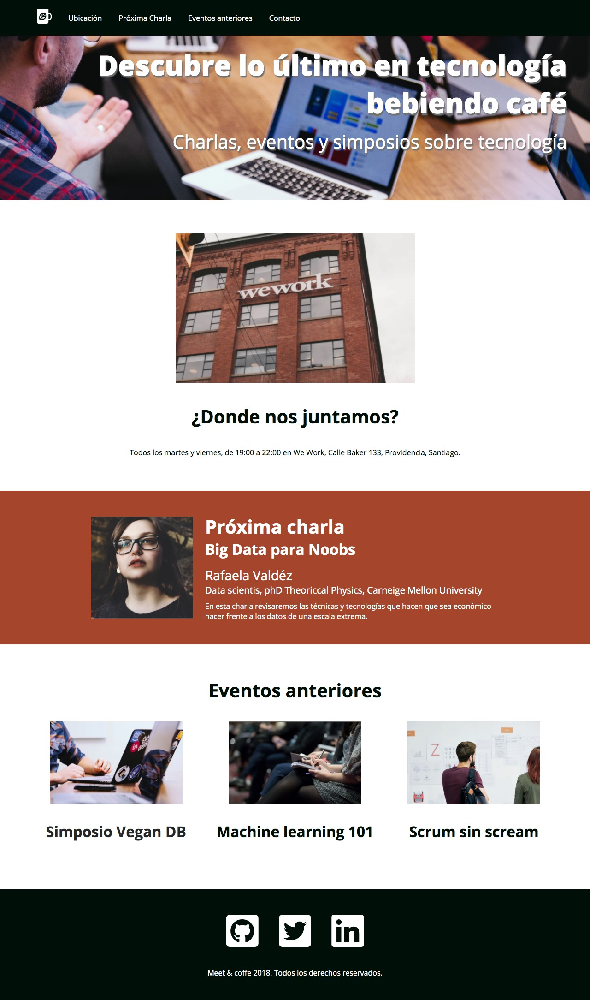

# Desafío - Meet & Coffee
> Aplicando todos los conceptos y herramientas aprendidas en la sesión presencial Creando
páginas web con HTML y CSS, vamos a añadir una segunda página al proyecto Meet&coffee.



## Requisitos

- Se solicita añadir una segunda página al proyecto "Meet&Coffee" siguiendo el layout
presentado.
- Desde la página principal de "Meet&coffe" ( index.html ) debes añadir un link hacia esta
nueva página.
- Realizar la construcción del HTML y CSS siguiendo la guía de estilo proporcionada.

Tipografías:
- Open Sans. 

font-weight:
- Open Sans Bold (800).
- Open Sans Regular (400).

Colores:
- #000f08
- #ffffff

Íconos (Font Awesome):
- fab fa-github-square
- fab fa-twitter-square
- fab fa-linkedin


```sh
/assets/img para las imágenes
/assets/css/style.css para el archivo CSS
/index.html
/evento01.html
```


